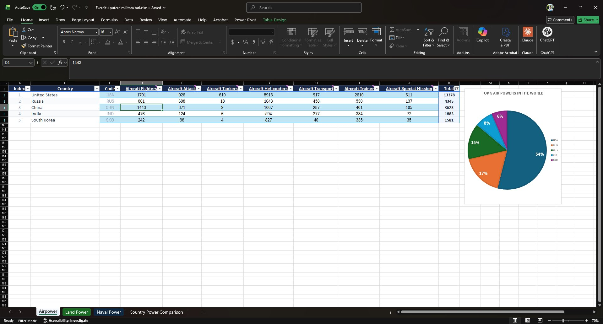
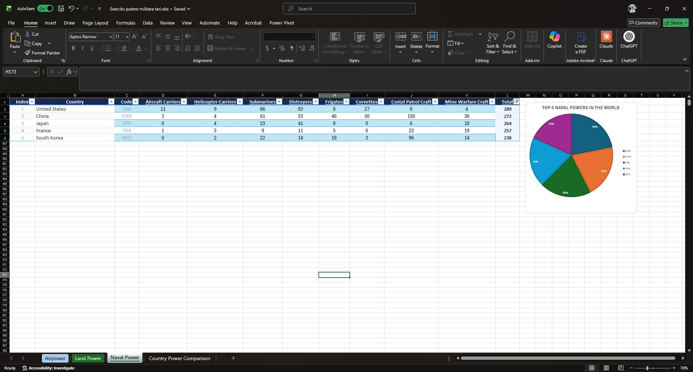
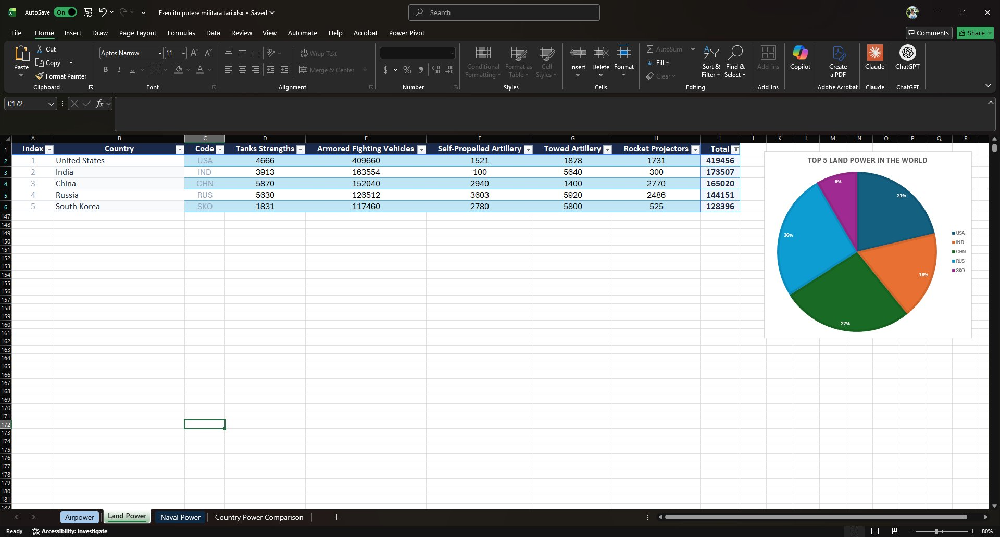
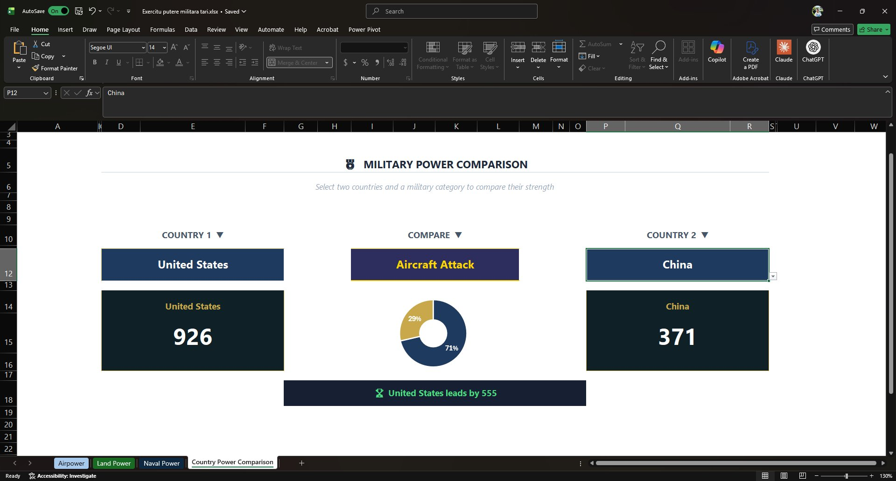

# Military Power Analysis

An Excel project comparing global military strength across air, naval, and land forces, with an interactive country-vs-country comparison dashboard.

## Where the idea came from

In early 2026, Trump's repeated threats to annex Greenland — including refusing to rule out military force against Denmark, a NATO ally — sparked a serious conversation about what would happen if the United States actually attacked another NATO member. Article 5 of the NATO treaty says an attack on one member is an attack on all, so the scenario raised an uncomfortable hypothetical: if the US moved on Greenland and Article 5 was activated, what would a military confrontation between the US and the rest of NATO even look like?

That question is what got me started. The original plan was a straight NATO vs US comparison. As I worked on it, I realized it made more sense to build something broader — a tool that lets anyone compare any two countries across any military category. The Greenland/NATO question was the spark; the project ended up being something more flexible.

---

## The sheets

### ✈️ Airpower

This sheet holds all the aerial data — fighters, attack aircraft, tankers, helicopters, transports, trainers, and special mission aircraft — pulled for every country tracked by GlobalFirepower. A pivot table ranks countries by total aircraft, and the pie chart highlights the **Top 5 Air Powers in the World**. As expected, the US dominates with 54% of the top-5 share.

### 🚢 Naval Power

The naval sheet breaks down fleets into aircraft carriers, helicopter carriers, submarines, destroyers, frigates, corvettes, coastal patrol craft, and mine warfare craft. The **Top 5 Naval Powers** pie chart shows a much tighter race than airpower — the US leads but with a much smaller margin, reflecting how countries like China, Japan, France, and South Korea have built serious maritime forces.

### 🪖 Land Power

Land forces cover tanks, armored fighting vehicles, self-propelled artillery, towed artillery, and rocket projectors. The **Top 5 Land Power** pie chart tells a different story than the other two — while the US still leads, India and China are right behind, and the distribution is more even. Raw land-unit counts favor countries with large armies and older inventories.

### ⚔️ Country Power Comparison (Dashboard)

This is the interactive part of the project. Three dropdowns let you pick **Country 1**, **Country 2**, and **what to compare** (aircraft attack, submarines, tanks, etc.). The dashboard then shows:

- Side-by-side cards with the exact unit counts for each country
- A donut chart visualizing the split between them
- A banner at the bottom declaring who leads and by how much

It's a clean 1v1 view that lets you answer specific questions quickly — for example, how does US attack aircraft strength compare to China's? (Answer: 926 vs 371, US leads by 555.)

---

## Methodology note

Rankings in this project are based on **total unit count**, not combat effectiveness or strategic value. This differs from GlobalFirepower's own ranking methodology, which weighs dozens of factors including logistics, geography, finances, and technology. A country with more tanks isn't necessarily more powerful in a real conflict — this is a raw-numbers view, not a strategic assessment.

## Data sources

- [GlobalFirepower](https://www.globalfirepower.com/) — unit counts across air, naval, and land categories
- [SIPRI](https://www.sipri.org/) — cross-referenced for context

Data was originally pulled via Power Query `From Web` imports, then converted to static values so the workbook no longer depends on live connections.

## Tools used

- Excel (Power Query, Power Pivot, Pivot Tables, Pivot Charts)
- Conditional Formatting, data validation, dropdowns
- Git + GitHub for version control

## Credits & honesty

I built this as part of my journey toward becoming a data analyst. The Excel foundations came from **Luke Barousse's Excel for Data Analytics** course, which I'd recommend to anyone starting out.

I also used **Claude** (Anthropic's AI) throughout the project — for things like understanding why `aircraft_total` on GlobalFirepower isn't the sum of its subcategories, figuring out how to break Power Query connections cleanly, debugging conditional formatting that broke when filters were applied, and talking through the design of the comparison dashboard. The ideas, the structure, and the build are mine; Claude was the person I could bounce questions off when I got stuck.

## Author

**Alex Parnica**
GitHub: [@Parnicoza](https://github.com/Parnicoza)
